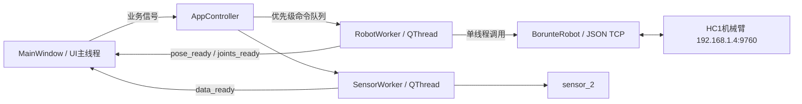

# 机械臂通信、界面与速度标定记录

## 1. 项目结构与约束

- Python 3.12 环境：`C:\Users\www61\anaconda3\envs\common`
- 主入口：`main.py`
- V2 界面：`main_window_2.ui`、`main_window_2.py`
- 机械臂客户端：`robot_client/robot_control.py`
- 机械臂协议参考实现：`demo/json_write.py`
- 传感器代码：`sensor_2`，保持不修改
- 机械臂默认地址：`192.168.1.4:9760`

## 2. 已完成的界面工作

- 增大左侧机械臂控制区域，缩小右侧传感器连接列。
- 末端位姿实时值采用 3×2 排布。
- 新增 J1～J6 关节角控制组，实时值采用 3×2 排布。
- 世界坐标和关节角均支持增量与绝对目标运动。
- 数值输入框不显示单位，单位放在独立标签中。
- 世界速度标签为 mm/s，关节速度标签为 deg/s。
- 位置记忆支持关节角/世界坐标类型切换。
- P1 默认关节位置：`(0, 16, -25, 0, 9, 0)`。
- 调用记忆只回填目标输入框，不直接触发机械臂运动。
- 清除按钮文字固定为“清除”。

## 3. 后台通信结构

### 3.1 主程序对象关系

`main.py` 是应用入口和总控制器，主要对象如下：

| 对象/类 | 所在线程 | 作用 |
|---|---|---|
| `AppController` | UI主线程 | 创建应用和窗口、连接信号、管理两个通信工作线程 |
| `MainWindow` | UI主线程 | 读取UI输入、显示状态与实时数据、发出业务信号 |
| `RobotWorker` | 机械臂QThread | 独占TCP socket、轮询位姿、串行执行机械臂指令 |
| `BorunteRobot` | 由RobotWorker调用 | 构造并收发HC1 JSON协议、执行速度换算 |
| `SensorWorker` | 传感器QThread | 周期读取力和扭矩，并通过Qt信号回传UI |
| `SensorCommunication` | 传感器链路 | 串口/Modbus通信，由现有`sensor_2`提供 |
| `SensorController` | 传感器链路 | 传感器业务读取与置零，由现有`sensor_2`提供 |



### 3.2 启动流程

1. 创建 `QApplication`，启用 Fusion 样式和 96 DPI。
2. 加载 `main_window_2.ui` 并创建 `MainWindow`。
3. 自动扫描描述中包含 `SERIAL-A` 的串口。
4. 连接窗口信号与 `AppController` 槽函数。
5. 初始禁用四个机械臂运动按钮，实时位姿显示为 `--`。
6. 注册 `aboutToQuit`，退出时停止机械臂和传感器线程。
7. 显示主窗口并进入 Qt 事件循环。

### 3.3 机械臂连接流程

1. UI读取IP和端口并发出 `robot_connect_requested`。
2. `AppController` 创建并启动 `RobotWorker`，UI线程不执行socket连接。
3. `RobotWorker` 创建 `BorunteRobot` 并连接TCP。
4. 连接成功后发送 `modifyGSPD=50`，固定全局速度5%。
5. 发出 `connected`，UI更新连接灯并启用运动按钮。
6. 工作线程每约120 ms读取一次世界坐标和关节角。
7. Qt信号将六维位姿和六关节角安全送回UI线程。

### 3.4 指令队列

`RobotWorker` 使用 `PriorityQueue`，每项结构为：

```text
(priority, sequence, command, args)
```

- 普通运动、使能、回零：优先级10。
- 急停和断开：优先级0。
- `sequence` 保证同一优先级按提交顺序执行。
- 所有查询和控制都由同一工作线程执行，避免多个线程同时读取同一socket导致JSON回复错配。

支持的命令映射：

| 队列命令 | 客户端方法 |
|---|---|
| `world_increment` | `move_world_increment` |
| `world_absolute` | `move_world_absolute` |
| `joint_increment` | `move_joints_increment` |
| `joint_absolute` | `move_joints_absolute` |
| `enable` | `enable` |
| `disable` | `disable` |
| `home` | `home` |
| `stop` | `emergency_stop` |

### 3.5 实时轮询与断开

`main.py` 中机械臂使用独立 `QThread`：

- 后台完成 TCP 连接、JSON 收发、实时轮询和运动命令。
- 同一个线程独占 socket，避免查询响应和运动响应串包。
- 实时读取世界坐标 X/Y/Z/U/V/W 和关节角 J1～J6。
- 断开连接后停止轮询，并将界面实时值清空为 `--`。
- 急停命令使用高优先级队列。
- 连接成功后明确发送 `modifyGSPD=50`，固定全局速度为 5.0%。

断开时：

1. 设置线程停止事件并插入高优先级断开命令。
2. 关闭机械臂socket。
3. UI连接状态变为断开。
4. 禁用四个运动按钮。
5. 世界坐标和关节角实时值全部显示为 `--`。

### 3.6 传感器流程

- 串口连接后创建 `SensorCommunication` 和 `SensorController`。
- `SensorWorker` 每50 ms调用一次 `monitor_2_sensor()`。
- 有效的Fz、Tz通过 `data_ready` 信号传回UI。
- 全部置零、压力置零和扭矩置零继续调用`sensor_2`现有接口。
- `sensor_2`目录没有因机械臂改造而修改。

## 4. 三种 action 的协议关系

依据培训教材和 HC1 V1.4 远程通信协议：

### action=4

- 名称：自由路径。
- `m0～m5`：J1～J6 关节角。
- `speed`：路径速度百分比，不是 deg/s。
- 使用关节运动前，先发送 `action=51, isUse=0` 关闭物理速度。

### action=10

- 名称：姿势直线。
- `m0～m5`：世界坐标 X/Y/Z/U/V/W。
- 原生 `speed` 是路径速度百分比，不是 mm/s。
- 本项目启用 action51 后，action10 完全不发送 `speed` 字段。

### action=51

- 名称：使用物理速度。
- `isUse=1`：启用。
- `isUse=0`：禁用。
- 本机实测表明 action51 仍与全局速度共同决定最终速度。

## 5. 控制器机械参数

- 最大线速度：2.000 m/s，即 2000 mm/s。
- 最大角速度：200°/s。
- 加速时间：0.250 s。
- 减速时间：0.250 s。
- S 加速/减速比例：30%。
- 平滑滤波：128 ms。
- 程序固定全局速度：5%。

## 6. action51 标定历史

### 6.1 全局速度约10%、加减速0.450 s、Z±30 mm

| action51.speed | 双向平均速度 mm/s |
|---:|---:|
| 1 | 1.892 |
| 2 | 3.585 |
| 3 | 5.127 |
| 4 | 6.542 |
| 5 | 7.789 |
| 7 | 10.104 |
| 10 | 12.759 |
| 15 | 16.483 |
| 20 | 18.376 |
| 30 | 21.700 |

### 6.2 全局速度约10%、加减速0.250 s、Z±30 mm

| action51.speed | 双向平均速度 mm/s |
|---:|---:|
| 1 | 1.928 |
| 2 | 3.721 |
| 3 | 5.401 |
| 4 | 6.958 |
| 5 | 8.422 |
| 7 | 10.972 |
| 10 | 14.548 |
| 15 | 19.202 |
| 20 | 23.000 |
| 30 | 28.440 |

缩短加减速时间后，高速短行程的平均速度明显提高。

### 6.3 全局速度100%、加减速0.250 s、Z±30 mm

| action51.speed | 双向平均速度 mm/s |
|---:|---:|
| 1 | 14.550 |
| 2 | 22.868 |
| 3 | 28.878 |
| 4 | 31.769 |
| 5 | 34.632 |

该结果与“全局10%、action51值放大10倍”的结果基本一致，说明全局速度和 action51.speed 共同作用。

### 6.4 精确1 mm/s最终标定

条件：全局速度5%、action51.speed=1、Z±100 mm。

| 方向 | 距离 mm | 时间 s | 平均速度 mm/s |
|---|---:|---:|---:|
| +Z | 100.001832 | 100.578 | 0.994271 |
| -Z | 100.004395 | 100.562 | 0.994455 |
| 双向平均 | — | — | **0.994363** |

相对1 mm/s误差约 -0.56%，正反向差约 0.00018 mm/s。

小数 `action51.speed=0.05` 在全局速度100%时触发报警219，说明本固件不能按该形式使用小数。最终采用全局速度5%和整数action51速度。

## 7. action4 J1 标定

条件：

- 全局速度5%。
- 最大角速度200°/s。
- J1从初始角增量+60°后返回。
- `ckStatus=0x01`，只移动J1。
- action51物理速度关闭。

| action4.speed | +J1 deg/s | -J1 deg/s | 双向平均 deg/s |
|---:|---:|---:|---:|
| 10 | 1.1511 | 1.1524 | 1.1518 |
| 20 | 2.3315 | 2.3315 | 2.3315 |
| 30 | 3.4254 | 3.4286 | 3.4270 |
| 50 | 5.5897 | 5.5814 | 5.5855 |
| 70 | 7.6638 | 7.6638 | 7.6638 |
| 100 | 10.6082 | 10.6666 | 10.6374 |

正反向重复性很好，但 action4.speed 不是直接 deg/s。

### J1期望速度建议

| 期望deg/s | action4.speed建议值 |
|---:|---:|
| 1 | 9 |
| 2 | 17 |
| 3 | 26 |
| 4 | 36 |
| 5 | 45 |
| 6 | 54 |
| 8 | 73 |
| 10 | 94 |

`robot_control.py` 使用完整实测点进行分段线性反插值，而不是只使用该近似表。

## 8. 当前程序的速度语义

### UI速度滑环

| 控件 | 范围 | 步长/刻度 | 默认值 | 单位 |
|---|---:|---:|---:|---|
| 末端增量速度滑环 | 1～100 | 单步1、分页5、每10显示刻度 | 5 | mm/s |
| 末端目标速度滑环 | 1～100 | 单步1、分页5、每10显示刻度 | 5 | mm/s |
| 关节增量速度滑环 | 1～10 | 单步1、分页1、每1显示刻度 | 5 | deg/s |
| 关节目标速度滑环 | 1～10 | 单步1、分页1、每1显示刻度 | 5 | deg/s |

滑环与右侧数值框双向绑定：拖动滑环更新数值框，修改数值框也同步滑环。关节滑环和数值框现在使用完全一致的1～10范围，不会再出现滑环拖到10以上而数值框被截断的情况。

### 世界坐标速度输入

- UI输入单位：mm/s。
- 连接后全局速度固定5%。
- action51速度使用输入的整数值。
- action10不带speed。
- 1 mm/s 已通过100 mm双向行程验证为0.99436 mm/s。
- 短距离运动的全程平均速度仍会受到0.250 s加减速影响。

### 关节角速度输入

- UI输入单位：deg/s。
- 当前允许1～10 deg/s。
- 客户端按J1实测表换算为action4.speed百分比。
- 速度10 deg/s约转换为action4.speed=94。
- 回零使用期望关节速度10 deg/s。

## 9. 重要限制

- 关节速度表只在J1上完成实机标定。
- J2～J6的最大转速、减速比和负载特性可能不同，因此不能声称所有关节都与J1完全一致。
- 多关节同时运动时，action4是同步路径速度，实际每个关节的角速度由各自角度差和同步规划共同决定。
- 若要求J2～J6分别达到精确deg/s，需要逐关节建立标定表。
- 修改全局速度、最大速度、加减速、滤波、负载或工具后，应重新标定。
- 急停actionStop会让模式进入停止，需要在示教器恢复自动模式。

## 10. 标定文件归档说明

临时标定脚本和原始 JSON 结果已经在标定完成后删除。经过确认的参数、双向实测结果和最终换算表均保留在本文档中；正式程序使用的标定常量保存在 `robot_client/robot_control.py`。

## 11. 正式文件职责

| 文件 | 职责 |
|---|---|
| `main.py` | 应用入口、信号编排、机械臂/传感器线程生命周期 |
| `main_window_2.ui` | V2界面布局、控件名称、滑环和输入框基础范围 |
| `main_window_2.py` | UI加载、运动请求对象、实时显示、位置记忆和控件联动 |
| `main_window.py` | 被V2窗口继承的通用传感器、图表和基础UI逻辑 |
| `robot_client/robot_control.py` | 正式机械臂业务API、全局速度设定、action4/action10/action51组合和标定换算 |
| `robot_client/mock_robot_server.py` | 离线JSON协议模拟，用于不连接真实机械臂时测试 |
| `demo/json_write.py` | 厂商JSON协议参考实现，正式客户端的底层基础 |
| `sensor_2/*` | 已验证的传感器通信与控制代码，保持独立 |

## 12. 当前操作流程

### 末端世界坐标运动

1. UI收集六维增量或绝对目标以及期望mm/s。
2. 请求对象通过Qt信号进入 `AppController`。
3. 请求加入 `RobotWorker` 普通优先级队列。
4. 增量运动先读取当前世界坐标并计算绝对目标。
5. 发送 `action51, isUse=1`，速度为UI输入整数。
6. 紧接着发送不含 `speed` 的 `action10`。

### 关节运动

1. UI收集J1～J6增量或绝对目标以及期望deg/s。
2. 客户端按J1实测表把deg/s反插值为action4.speed。
3. 增量运动先读取当前关节角并计算绝对目标。
4. 发送 `action51, isUse=0` 关闭物理速度。
5. 发送 `action4` 和六关节目标。

### 回零与急停

- 回零不是调用协议原生home，而是发送六关节目标 `(0,0,0,0,0,0)`，期望速度10 deg/s。
- 急停发送 `actionStop`，它会断开使能并使控制器进入停止模式。
- 急停后必须在示教器恢复自动模式，才能继续远程运动。

## 13. 试验功能当前状态

已按提交 `648864cd9bece30e6b5bd36c38f4c78a80efe88e` 恢复：贯入试验与剪切试验的启动按钮目前仅保留界面占位，不发送机械臂运动指令，也不执行Fz/Tz阈值急停。试验参数输入框继续使用该提交中的单位后缀显示。
