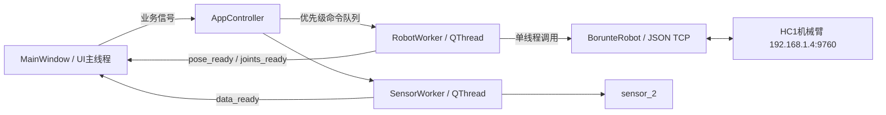

# 机械臂通信、界面与速度标定记录

## 1. 项目结构与约束

- Python 3.12 环境：`C:\Users\www61\anaconda3\envs\common`
- 已归档主入口：`apps/sensor_2_control_v2/main.py`
- V2 界面：`apps/sensor_2_control_v2/main_window_2.ui`、`apps/sensor_2_control_v2/main_window_2.py`
- 机械臂客户端：`robot_client/robot_control.py`
- 机械臂协议参考实现：`demo/json_write.py`
- 传感器代码：`sensor_2`，保持不修改
- 机械臂默认地址：`192.168.1.4:9760`

## 2. 已完成的界面工作

- 增大左侧机械臂控制区域，缩小右侧传感器连接列。
- 末端位姿实时值采用 3×2 排布。
- 新增 J1～J6 关节角控制组，实时值采用 3×2 排布。
- 世界坐标和关节角均支持增量与绝对目标运动。
- 数值输入框不显示单位，单位放在独立标签中。
- 世界速度标签为 mm/s，关节速度标签为 deg/s。
- 位置记忆支持关节角/世界坐标类型切换。
- P1 默认关节位置：`(0, 16, -25, 0, 9, 0)`。
- 调用记忆只回填目标输入框，不直接触发机械臂运动。
- 清除按钮文字固定为“清除”。

## 3. 后台通信结构

### 3.1 主程序对象关系

`main.py` 是应用入口和总控制器，主要对象如下：

| 对象/类 | 所在线程 | 作用 |
|---|---|---|
| `AppController` | UI主线程 | 创建应用和窗口、连接信号、管理两个通信工作线程 |
| `MainWindow` | UI主线程 | 读取UI输入、显示状态与实时数据、发出业务信号 |
| `RobotWorker` | 机械臂QThread | 独占TCP socket、轮询位姿、串行执行机械臂指令 |
| `BorunteRobot` | 由RobotWorker调用 | 构造并收发HC1 JSON协议、执行速度换算 |
| `SensorWorker` | 传感器QThread | 周期读取力和扭矩，并通过Qt信号回传UI |
| `SensorCommunication` | 传感器链路 | 串口/Modbus通信，由现有`sensor_2`提供 |
| `SensorController` | 传感器链路 | 传感器业务读取与置零，由现有`sensor_2`提供 |



### 3.2 启动流程

1. 创建 `QApplication`，启用 Fusion 样式和 96 DPI。
2. 加载 `main_window_2.ui` 并创建 `MainWindow`。
3. 自动扫描描述中包含 `SERIAL-A` 的串口。
4. 连接窗口信号与 `AppController` 槽函数。
5. 初始禁用四个机械臂运动按钮，实时位姿显示为 `--`。
6. 注册 `aboutToQuit`，退出时停止机械臂和传感器线程。
7. 显示主窗口并进入 Qt 事件循环。

### 3.3 机械臂连接流程

1. UI读取IP和端口并发出 `robot_connect_requested`。
2. `AppController` 创建并启动 `RobotWorker`，UI线程不执行socket连接。
3. `RobotWorker` 创建 `BorunteRobot` 并连接TCP。
4. 连接成功后发送 `modifyGSPD=50`，固定全局速度5%。
5. 发出 `connected`，UI更新连接灯并启用运动按钮。
6. 工作线程每约120 ms读取一次世界坐标和关节角。
7. Qt信号将六维位姿和六关节角安全送回UI线程。

### 3.4 指令队列

`RobotWorker` 使用 `PriorityQueue`，每项结构为：

```text
(priority, sequence, command, args)
```

- 普通运动、使能、回零：优先级10。
- 急停和断开：优先级0。
- `sequence` 保证同一优先级按提交顺序执行。
- 所有查询和控制都由同一工作线程执行，避免多个线程同时读取同一socket导致JSON回复错配。

支持的命令映射：

| 队列命令 | 客户端方法 |
|---|---|
| `world_increment` | `move_world_increment` |
| `world_absolute` | `move_world_absolute` |
| `joint_increment` | `move_joints_increment` |
| `joint_absolute` | `move_joints_absolute` |
| `enable` | `enable` |
| `disable` | `disable` |
| `home` | `home` |
| `stop` | `emergency_stop` |

### 3.5 实时轮询与断开

`main.py` 中机械臂使用独立 `QThread`：

- 后台完成 TCP 连接、JSON 收发、实时轮询和运动命令。
- 同一个线程独占 socket，避免查询响应和运动响应串包。
- 实时读取世界坐标 X/Y/Z/U/V/W 和关节角 J1～J6。
- 断开连接后停止轮询，并将界面实时值清空为 `--`。
- 急停命令使用高优先级队列。
- 连接成功后明确发送 `modifyGSPD=50`，固定全局速度为 5.0%。

断开时：

1. 设置线程停止事件并插入高优先级断开命令。
2. 关闭机械臂socket。
3. UI连接状态变为断开。
4. 禁用四个运动按钮。
5. 世界坐标和关节角实时值全部显示为 `--`。

### 3.6 传感器流程

- 串口连接后创建 `SensorCommunication` 和 `SensorController`。
- `SensorWorker` 每50 ms调用一次 `monitor_2_sensor()`。
- 有效的Fz、Tz通过 `data_ready` 信号传回UI。
- 全部置零、压力置零和扭矩置零继续调用`sensor_2`现有接口。
- `sensor_2`目录没有因机械臂改造而修改。

## 4. 三种 action 的协议关系

依据培训教材和 HC1 V1.4 远程通信协议：

### action=4

- 名称：自由路径。
- `m0～m5`：J1～J6 关节角。
- `speed`：路径速度百分比，不是 deg/s。
- 使用关节运动前，先发送 `action=51, isUse=0` 关闭物理速度。

### action=10

- 名称：姿势直线。
- `m0～m5`：世界坐标 X/Y/Z/U/V/W。
- 原生 `speed` 是路径速度百分比，不是 mm/s。
- 本项目启用 action51 后，action10 完全不发送 `speed` 字段。

### action=51

- 名称：使用物理速度。
- `isUse=1`：启用。
- `isUse=0`：禁用。
- 本机实测表明 action51 仍与全局速度共同决定最终速度。

## 5. 控制器机械参数

- 最大线速度：2.000 m/s，即 2000 mm/s。
- 最大角速度：200°/s。
- 加速时间：0.250 s。
- 减速时间：0.250 s。
- S 加速/减速比例：30%。
- 平滑滤波：128 ms。
- 程序固定全局速度：5%。

## 6. action51 标定历史

### 6.1 全局速度约10%、加减速0.450 s、Z±30 mm

| action51.speed | 双向平均速度 mm/s |
|---:|---:|
| 1 | 1.892 |
| 2 | 3.585 |
| 3 | 5.127 |
| 4 | 6.542 |
| 5 | 7.789 |
| 7 | 10.104 |
| 10 | 12.759 |
| 15 | 16.483 |
| 20 | 18.376 |
| 30 | 21.700 |

### 6.2 全局速度约10%、加减速0.250 s、Z±30 mm

| action51.speed | 双向平均速度 mm/s |
|---:|---:|
| 1 | 1.928 |
| 2 | 3.721 |
| 3 | 5.401 |
| 4 | 6.958 |
| 5 | 8.422 |
| 7 | 10.972 |
| 10 | 14.548 |
| 15 | 19.202 |
| 20 | 23.000 |
| 30 | 28.440 |

缩短加减速时间后，高速短行程的平均速度明显提高。

### 6.3 全局速度100%、加减速0.250 s、Z±30 mm

| action51.speed | 双向平均速度 mm/s |
|---:|---:|
| 1 | 14.550 |
| 2 | 22.868 |
| 3 | 28.878 |
| 4 | 31.769 |
| 5 | 34.632 |

该结果与“全局10%、action51值放大10倍”的结果基本一致，说明全局速度和 action51.speed 共同作用。

### 6.4 精确1 mm/s最终标定

条件：全局速度5%、action51.speed=1、Z±100 mm。

| 方向 | 距离 mm | 时间 s | 平均速度 mm/s |
|---|---:|---:|---:|
| +Z | 100.001832 | 100.578 | 0.994271 |
| -Z | 100.004395 | 100.562 | 0.994455 |
| 双向平均 | — | — | **0.994363** |

相对1 mm/s误差约 -0.56%，正反向差约 0.00018 mm/s。

小数 `action51.speed=0.05` 在全局速度100%时触发报警219，说明本固件不能按该形式使用小数。最终采用全局速度5%和整数action51速度。

## 7. action4 J1 标定

条件：

- 全局速度5%。
- 最大角速度200°/s。
- J1从初始角增量+60°后返回。
- `ckStatus=0x01`，只移动J1。
- action51物理速度关闭。

| action4.speed | +J1 deg/s | -J1 deg/s | 双向平均 deg/s |
|---:|---:|---:|---:|
| 10 | 1.1511 | 1.1524 | 1.1518 |
| 20 | 2.3315 | 2.3315 | 2.3315 |
| 30 | 3.4254 | 3.4286 | 3.4270 |
| 50 | 5.5897 | 5.5814 | 5.5855 |
| 70 | 7.6638 | 7.6638 | 7.6638 |
| 100 | 10.6082 | 10.6666 | 10.6374 |

正反向重复性很好，但 action4.speed 不是直接 deg/s。

### J1期望速度建议

| 期望deg/s | action4.speed建议值 |
|---:|---:|
| 1 | 9 |
| 2 | 17 |
| 3 | 26 |
| 4 | 36 |
| 5 | 45 |
| 6 | 54 |
| 8 | 73 |
| 10 | 94 |

`robot_control.py` 使用完整实测点进行分段线性反插值，而不是只使用该近似表。

## 8. 当前程序的速度语义

### UI速度滑环

| 控件 | 范围 | 步长/刻度 | 默认值 | 单位 |
|---|---:|---:|---:|---|
| 末端增量速度滑环 | 1～100 | 单步1、分页5、每10显示刻度 | 5 | mm/s |
| 末端目标速度滑环 | 1～100 | 单步1、分页5、每10显示刻度 | 5 | mm/s |
| 关节增量速度滑环 | 1～10 | 单步1、分页1、每1显示刻度 | 5 | deg/s |
| 关节目标速度滑环 | 1～10 | 单步1、分页1、每1显示刻度 | 5 | deg/s |

滑环与右侧数值框双向绑定：拖动滑环更新数值框，修改数值框也同步滑环。关节滑环和数值框现在使用完全一致的1～10范围，不会再出现滑环拖到10以上而数值框被截断的情况。

### 世界坐标速度输入

- UI输入单位：mm/s。
- 连接后全局速度固定5%。
- action51速度使用输入的整数值。
- action10不带speed。
- 1 mm/s 已通过100 mm双向行程验证为0.99436 mm/s。
- 短距离运动的全程平均速度仍会受到0.250 s加减速影响。

### 关节角速度输入

- UI输入单位：deg/s。
- 当前允许1～10 deg/s。
- 客户端按J1实测表换算为action4.speed百分比。
- 速度10 deg/s约转换为action4.speed=94。
- 回零使用期望关节速度10 deg/s。

## 9. 重要限制

- 关节速度表只在J1上完成实机标定。
- J2～J6的最大转速、减速比和负载特性可能不同，因此不能声称所有关节都与J1完全一致。
- 多关节同时运动时，action4是同步路径速度，实际每个关节的角速度由各自角度差和同步规划共同决定。
- 若要求J2～J6分别达到精确deg/s，需要逐关节建立标定表。
- 修改全局速度、最大速度、加减速、滤波、负载或工具后，应重新标定。
- 急停actionStop会让模式进入停止，需要在示教器恢复自动模式。

## 10. 标定文件归档说明

临时标定脚本和原始 JSON 结果已经在标定完成后删除。经过确认的参数、双向实测结果和最终换算表均保留在本文档中；正式程序使用的标定常量保存在 `robot_client/robot_control.py`。

## 11. 正式文件职责

| 文件 | 职责 |
|---|---|
| `main.py` | 应用入口、信号编排、机械臂/传感器线程生命周期 |
| `main_window_2.ui` | V2界面布局、控件名称、滑环和输入框基础范围 |
| `main_window_2.py` | UI加载、运动请求对象、实时显示、位置记忆和控件联动 |
| `main_window.py` | 被V2窗口继承的通用传感器、图表和基础UI逻辑 |
| `robot_client/robot_control.py` | 正式机械臂业务API、全局速度设定、action4/action10/action51组合和标定换算 |
| `robot_client/mock_robot_server.py` | 离线JSON协议模拟，用于不连接真实机械臂时测试 |
| `demo/json_write.py` | 厂商JSON协议参考实现，正式客户端的底层基础 |
| `sensor_2/*` | 已验证的传感器通信与控制代码，保持独立 |

## 12. 当前操作流程

### 末端世界坐标运动

1. UI收集六维增量或绝对目标以及期望mm/s。
2. 请求对象通过Qt信号进入 `AppController`。
3. 请求加入 `RobotWorker` 普通优先级队列。
4. 增量运动先读取当前世界坐标并计算绝对目标。
5. 发送 `action51, isUse=1`，速度为UI输入整数。
6. 紧接着发送不含 `speed` 的 `action10`。

### 关节运动

1. UI收集J1～J6增量或绝对目标以及期望deg/s。
2. 客户端按J1实测表把deg/s反插值为action4.speed。
3. 增量运动先读取当前关节角并计算绝对目标。
4. 发送 `action51, isUse=0` 关闭物理速度。
5. 发送 `action4` 和六关节目标。

action4的 `ckStatus` 不再固定为 `0x3F`，而是根据目标与当前关节角的差异自动生成：J1=`0x01`、J2=`0x02`、J3=`0x04`、J4=`0x08`、J5=`0x10`、J6=`0x20`。单独控制J6时必须发送 `0x20`；J6对应bit5，不是bit6，因此不能使用 `0x40`。多关节运动时将相应位按位或。

### 回零与急停

- 回零不是调用协议原生home，而是发送六关节目标 `(0,0,0,0,0,0)`，期望速度10 deg/s。
- 急停发送 `actionStop`，它会断开使能并使控制器进入停止模式。
- 急停后必须在示教器恢复自动模式，才能继续远程运动。

## 13. 试验功能当前状态

试验区的速度、距离、力、角速度、角位移和扭矩输入框只显示数字，单位由右侧独立 `QLabel` 显示。贯入试验按钮现用于提交末端方向直线插补；剪切试验仍为占位功能。Fz/Tz阈值联锁尚未重新启用。

## 14. 末端方向直线插补

### 14.1 代码归属

- `demo` 仅保留厂家示例，不再被正式程序导入。
- 底层HC1 JSON/TCP协议迁入 `robot_client/hc1_json.py`。
- 速度控制、方向计算与插补队列位于 `robot_client/robot_control.py`。
- `main.py` 只负责从UI读取参数并向 `RobotWorker` 提交 `tool_vector_line` 命令。

### 14.2 方向和轨迹

程序读取起始世界位姿。根据本机械臂的贯入方向约定，运动向量只由俯仰角 `Ry(V)` 在世界XZ平面内确定；X取前向正分量，正Ry对应Z负向：

```text
ux = cos(Ry)
uy = 0
uz = -sin(Ry)
```

正式程序输入距离限制为 `-10～10 mm`，demo在线测试范围已扩展到±60 mm。负距离沿上述向量的反方向运动。U/W不参与方向计算，只与V一起作为保持不变的末端姿态；action10使用 `ckStatus=0x07`，不控制UVW轴。开始前必须满足自动模式、无报警且机械臂静止。

### 14.3 插补队列

插补点数为：

```text
segments = ceil(abs(distance) / speed × frequency)
```

整段点列一次性写入控制器，避免Python定时器和TCP往返延迟影响点间节拍。action51负责物理线速度；各action10不带speed，平滑等级暂设为9。

### 14.4 2026-07-15首次实机结果

- 条件：1 mm/s、+2 mm、5 Hz、10个插补段。
- 控制器确认AddRCC，但8秒内未完成。
- 位置仅变化约0.002 mm时，W已从约 `-170.000°` 变为 `-168.545°`。
- 随即发送actionStop；停止后模式为3、报警码42。
- 初步原因是起始U由监控接口显示为 `+180°`，而控制器内部等价姿态靠近 `-180°`，直接下发 `+180°` 可能触发欧拉角长路径。代码已增加角度规范化，但必须在现场恢复自动模式并清除报警后重新验证，不能把5 Hz视为最终合格频率。

### 14.5 第二次action10验证与停止行为

- 恢复自动后，以1 mm/s、+1 mm、5 Hz、5段再次提交。
- 新AddRCC回复为 `['AddRCC', 'err']`；程序已修正回复校验，今后不再把包含err的字典当作成功。
- 控制器仍执行了旧远程列表，约3.27秒时旋转矩阵姿态差达到0.302°，位置变化仅约0.0025 mm。
- `stopButton`、普通 `stop`、`actionPause` 均回复ok，但 `isMoving` 始终为1，W持续从约-170°偏转到-162.7°。
- 为阻止超出授权轨迹的持续旋转，最终只能发送actionStop；机械臂进入模式3并出现报警42，随后报警已清除但仍需现场处理远程列表。
- 在示教器明确清空远程指令列表前不得恢复自动测试，否则旧列表可能续跑。

### 14.6 action17准备状态

正式客户端已增加六轴action17姿势曲线构造器和 `move_tool_vector_curve()` 对比接口：m0～m5为起点，m0_p～m5_p为终点，起终点使用同一规范化姿态。尚未实机执行；必须先在示教器清空旧远程指令列表，再进行+1 mm低风险验证。

### 14.7 action17实机验证与轴掩码结论

- action17单独下发时返回ok并立即删除，但+1 mm和+5 mm均未开始运动，说明曲线指令需要前置路径点。
- 使用“当前位姿action10 + action17终点”的组合后开始运动，但0.44秒内姿态矩阵偏差达到0.388°，位置几乎未移动。
- stopButton仍返回ok但无法结束远程动作，最终使用actionStop兜底停止，模式3、报警42。
- 对照协议发现此前 `ckStatus=0x3F` 启用了XYZUVW全部六轴。协议明确指出仅使用XYZ方向时应使用 `0x07`。
- 新版直线插补和action17试验接口已改为 `ckStatus=0x07`，从控制器层面屏蔽UVW姿态轴；该方案需要清除报警、清空列表并恢复自动后再验证。

### 14.8 `ckStatus=0x07`最终验证与频率选择

仅启用XYZ轴后，末端姿态保持问题得到解决。1 mm往返实测如下：

| 方案 | 完成时间 | 最大姿态矩阵角差 | 结果 |
|---|---:|---:|---|
| 单段action10 | 约1.55 s | 0.00079° | 成功 |
| 5 Hz，5个waypoint | 约1.92～1.94 s | 0.00084～0.0010° | 成功 |
| 10 Hz，10个waypoint | 约2.70 s | 0.00093° | 成功但规划开销明显 |
| 20 Hz，20个waypoint | 未执行 | — | 控制器重置TCP连接 |

最终采用5 Hz作为软件插补默认频率，并限制每次最多10个waypoint：

- 5 Hz在姿态稳定性和控制器负载之间较合适。
- 提高到10 Hz不会改善姿态精度，反而增加约40%的完成时间。
- 20 Hz超过当前控制器稳定处理能力，禁止使用。
- 长距离/低速度导致理论点数超过10时会自动降采样，以免报文过大。
- 保持姿态的决定性设置是 `ckStatus=0x07`；频率仅影响路径点密度和规划开销。

当前HC1固件对 `action51 + action10` 组合会回复 `['AddRCC','err']`，但指令实际正常执行并最终到达目标。正式客户端因此保留回复用于记录，同时以实时 `isMoving` 和最终位姿作为实机执行依据。

### 14.9 demo末端方向20 mm在线测试

> 更正：本节使用了旧的 `Rz×Ry×Rx` 局部+X方向算法。运动距离、直线度和姿态保持测量有效，但方向不符合当前“X正向、Z随正Ry向负”的贯入定义，不能作为正确方向验证。

2026-07-15使用 `demo/json_write.py` 的 `move_along_tool_x()` 在线测试：

- 起点XYZ：`(455.050903, 80.129425, 738.795227)` mm。
- 起点姿态：`(180.000000, 51.501770, -170.000458)` deg。
- 末端局部+X在世界系的单位向量：`(-0.613034, -0.108089, -0.782627)`。
- 指令距离：+20 mm；物理速度：1 mm/s；`ckStatus=0x07`。
- 理论ΔXYZ：`(-12.261, -2.162, -15.653)` mm。
- 实际三维位移：19.995938 mm。
- 最终目标误差：0.004108 mm。
- 最大直线偏差：0.002627 mm。
- 最大姿态矩阵角差：0.001015°。
- 完成时间：20.563 s；结束时自动模式、静止、无报警、远程列表为0。

该次测试仅证明 `ckStatus=0x07` 能保持姿态且空间位移长度准确；方向算法已在后续更正。

### 14.10 demo末端方向±50 mm在线测试

> 更正：本节±50 mm测试使用了错误的旧方向向量 `(-0.707107,0,-0.707106)`。按当前定义，Ry约45°时正确正向应为 `(+0.707107,0,-0.707107)`。以下数据只保留作为距离精度、往返误差和姿态稳定性记录。

2026-07-15将 `move_along_tool_x()` 的距离范围扩展到±50 mm，并以1 mm/s完成正反向测试。起始姿态约为 `(U,V,W)=(180°,45°,180°)`，单位方向约为 `(-0.707107,0,-0.707106)`。

| 指令 | 实际三维位移 | 目标误差 | 最大直线偏差 | 最大姿态角差 | 用时 |
|---|---:|---:|---:|---:|---:|
| +50 mm | 49.998781 mm | 0.001387 mm | 0.002982 mm | 0.001007° | 50.641 s |
| -50 mm | 50.003011 mm | 0.003048 mm | 0.002817 mm | 0.001022° | 50.625 s |

- +50 mm理论ΔXYZ约为 `(-35.355,0,-35.355)` mm。
- -50 mm返回理论ΔXYZ约为 `(+35.355,0,+35.356)` mm。
- 正负往返后的最终位置距最初起点约0.004286 mm。
- 两段结束时均为自动模式、静止、无报警、远程列表为0。


### 14.11 修正方向后的±60 mm在线验证

2026-07-15按修正后的世界XZ方向公式进行在线验证：

```text
ux = cos(Ry)
uy = 0
uz = -sin(Ry)
```

起始 `Ry≈45.000774°`，因此正向60 mm理论增量为 `(+42.425834, 0, -42.426980)` mm，符合“ΔX为正、ΔZ为负”的定义。

| 指令 | 实际三维位移 | 目标误差 | 最大直线偏差 | 最大姿态角差 | 用时 |
|---|---:|---:|---:|---:|---:|
| +60 mm | 60.001014 mm | 0.001412 mm | 0.004359 mm | 0.001156° | 60.563 s |
| -60 mm | 60.000323 mm | 0.002775 mm | 0.004429 mm | 0.001018° | 60.547 s |

- +60 mm实际轨迹方向为X增加、Z减少。
- -60 mm实际轨迹方向为X减少、Z增加。
- 正负往返后的最终位置距初始点约0.00420 mm。
- 两段结束时均为自动模式、静止、无报警、远程列表为0。

## 15. demo使用教程

完整独立教程位于 `demo/README.md`。`demo` 仅用于协议学习和实机调试，不作为主程序函数库；正式程序只调用 `robot_client`。

### 15.1 常用命令

在项目根目录执行：

```powershell
# 读取模式、运动状态、报警和世界位姿
C:\Users\www61\anaconda3\envs\common\python.exe demo\json_write.py read_status

# 读取末端世界坐标
C:\Users\www61\anaconda3\envs\common\python.exe demo\json_write.py read_pose

# 沿修正后的姿态正方向移动10 mm，速度1 mm/s
C:\Users\www61\anaconda3\envs\common\python.exe demo\json_write.py tool_x 10 --speed 1

# 沿反方向返回10 mm
C:\Users\www61\anaconda3\envs\common\python.exe demo\json_write.py tool_x -10 --speed 1
```

### 15.2 tool_x执行条件

执行前必须确认：

1. `curMode=2`，机械臂处于自动模式。
2. `isMoving=0`，机械臂静止。
3. `curAlarm=0`，当前无报警。
4. `RemoteCmdLen=0`，没有残留远程指令。
5. 运动路径无人员和障碍物。

当前demo允许距离为±60 mm，速度最低1 mm/s。方向使用：

```text
(ux,uy,uz) = (cos(Ry), 0, -sin(Ry))
```

action51设置物理速度，action10只发送XYZ绝对目标并使用 `ckStatus=0x07`，因此UVW姿态轴保持不变。

本项目为六轴机械臂，所有正式与demo运动报文都只包含 `m0～m5`：action4对应J1～J6，action10对应X、Y、Z、U、V、W。action17也只包含 `m0～m5` 和 `m0_p～m5_p`。代码不再发送 `m6`、`m7`、`m6_p` 或 `m7_p`，模拟服务器和读取示例也统一为六轴。

### 15.3 结果判断

控制器可能对有效的 `action51 + action10` 返回 `AddRCC/err`。判断是否成功应结合：

- `isMoving` 是否经历 `0→1→0`。
- 最终XYZ与理论目标的误差。
- 三维实际距离是否接近输入距离。
- `curAlarm` 是否保持0。
- U/V/W或姿态矩阵是否保持稳定。

## 16. J6最大角速度在线测试

2026-07-16在以下条件下测试J6：

- 全局速度：5%。
- action51：关闭物理速度。
- action4.speed：100。
- 运动轴：仅J6，自动掩码 `ckStatus=0x20`。
- 测试行程：+30°后-30°返回。

| 方向 | 实际角度 | 运动段时间 | 全程平均速度 | 5采样稳定段中位速度 | 5采样峰值速度 |
|---|---:|---:|---:|---:|---:|
| J6 +30° | 29.991165° | 1.454721 s | 20.6164°/s | 27.8952°/s | 29.5290°/s |
| J6 -30° | 29.991166° | 1.455739 s | 20.6020°/s | 27.8779°/s | 29.4936°/s |

结论：当前全局5%、action4.speed=100条件下，J6实测峰值约 `29.5°/s`，稳定高速段约 `27.9°/s`。包含加减速的30°全程平均约 `20.6°/s`。正反向结果一致，返回J6约 `-1.007952°`，与测试前位置一致；结束时自动、静止、无报警、远程列表为0。

注意：此前J1标定的action4速度换算不能直接代表J6。相同action4.speed=100时，J1实测约10.64°/s，而J6约29.5°/s；如需UI输入值对每个关节都代表真实deg/s，应分别标定各关节或建立逐轴速度表。

## 17. 六关节1～20 deg/s逐轴标定与自动掩码（2026-07-16）

### 17.1 标定条件与结果

- 示教机全局速度：10%。
- 加速时间/减速时间：0.250 s / 0.250 s。
- S加减速比例：30%；平滑滤波：128 ms。
- 每个关节分别做正、反向运动；采样位置差分，取高速稳定段后对双向结果求平均。
- 测试结束：自动模式、静止、无报警、远程指令列表为空，关节回到近零位。

下表单元格为“实测角速度 deg/s”，列标题为发送的action4.speed百分比：

| 关节 | 5 | 10 | 20 | 30 | 50 | 70 | 100 |
|---|---:|---:|---:|---:|---:|---:|---:|
| J1 | 1.164 | 2.378 | 4.757 | 7.134 | 11.886 | 16.641 | 23.649 |
| J2 | 1.307 | 2.672 | 5.344 | 8.014 | 13.354 | 18.685 | 25.742 |
| J3 | 1.851 | 3.700 | 7.395 | 11.092 | 18.469 | 25.141 | 32.048 |
| J4 | 1.690 | 3.380 | 6.756 | 10.130 | 16.890 | 23.560 | 31.617 |
| J5 | 2.997 | 5.991 | 11.963 | 17.733 | 29.118 | 36.660 | 42.918 |
| J6 | 2.948 | 5.894 | 11.716 | 17.052 | 27.750 | 34.368 | 38.711 |

正式程序以分段线性反插值覆盖1～20 deg/s。下表为界面输入整数角速度时实际发送的action4.speed：

| deg/s | J1 | J2 | J3 | J4 | J5 | J6 |
|---:|---:|---:|---:|---:|---:|---:|
| 1 | 4 | 4 | 3 | 3 | 2 | 2 |
| 2 | 8 | 8 | 5 | 6 | 3 | 3 |
| 3 | 13 | 11 | 8 | 9 | 5 | 5 |
| 4 | 17 | 15 | 11 | 12 | 7 | 7 |
| 5 | 21 | 19 | 14 | 15 | 8 | 8 |
| 6 | 25 | 22 | 16 | 18 | 10 | 10 |
| 7 | 29 | 26 | 19 | 21 | 12 | 12 |
| 8 | 34 | 30 | 22 | 24 | 13 | 14 |
| 9 | 38 | 34 | 24 | 27 | 15 | 15 |
| 10 | 42 | 37 | 27 | 30 | 17 | 17 |
| 11 | 46 | 41 | 30 | 33 | 18 | 19 |
| 12 | 50 | 45 | 32 | 36 | 20 | 21 |
| 13 | 55 | 49 | 35 | 38 | 22 | 22 |
| 14 | 59 | 52 | 38 | 41 | 24 | 24 |
| 15 | 63 | 56 | 41 | 44 | 25 | 26 |
| 16 | 67 | 60 | 43 | 47 | 27 | 28 |
| 17 | 72 | 64 | 46 | 50 | 29 | 30 |
| 18 | 76 | 67 | 49 | 53 | 30 | 32 |
| 19 | 80 | 71 | 52 | 56 | 32 | 34 |
| 20 | 84 | 76 | 55 | 59 | 34 | 36 |

action4只有一个公共speed字段。单轴运动可按该轴曲线达到输入角速度；多轴同步运动无法让不同机械特性的关节同时严格达到同一个角速度，因此程序取所有活动轴所需百分比的最小值，保证任何活动轴均不超过用户输入值。

### 17.2 自动ckStatus

- 世界坐标增量：X=`0x01`、Y=`0x02`、Z=`0x04`、Rx=`0x08`、Ry=`0x10`、Rz=`0x20`。
- 关节增量：J1=`0x01`、J2=`0x02`、J3=`0x04`、J4=`0x08`、J5=`0x10`、J6=`0x20`。
- 程序检查六个增量，绝对值大于容差的轴置位，再按位或得到最终掩码。例如第1、3、6轴运动得到 `0x01 | 0x04 | 0x20 = 0x25`。
- 关节绝对目标同样读取当前关节角，以目标与当前值的差自动判别活动轴。

### 17.3 界面与正式程序更新

- `main_window_2.ui` 中关节增量速度和目标速度的滑环、数值框上限均改为20 deg/s。
- `robot_client/robot_control.py` 保存六套标定曲线，连接后设置全局速度10%，并按活动轴换算action4.speed。
- 世界坐标增量和关节增量均无需调用者提供ckStatus；`demo`仍只作为使用示例，不被正式主程序调用。

## 18. 贯入试验、剪切试验与XLSX采集（2026-07-16）

### 18.1 贯入试验

- 点击“贯入试验启动”后读取位移速度、位移距离和最大力。
- 正式控制层调用 `move_along_tool_x(distance_mm, speed_mm_s)`：读取启动时世界位姿，根据当前末端姿态计算工具X轴在世界坐标中的单位向量，将输入距离乘以该向量得到最终XYZ；U/V/W保持启动值。
- action51设置物理线速度，action10发送最终世界坐标且使用 `ckStatus=0x07`。
- 主程序每50 ms采样一次。贯入深度为当前XYZ相对起点位移在运动单位向量上的投影，并从0开始。
- 实际XYZ到达目标坐标（0.3 mm容差）、投影深度到达输入距离，或者相对Fz绝对值达到最大力时结束。
- 条件触发只发送控制器 `stopButton`，不使用会切入报警状态的停止指令。
- 曲线横轴为贯入深度/mm，纵轴为起点置零后的拉压力/N。传感器未连接或试验中断开时，力和扭矩均按0采集，曲线仍继续刷新。

### 18.2 剪切试验

- 点击“剪切试验启动”后读取角速度、角位移和最大扭矩。
- 通过关节增量接口只设置J6增量，其余J1～J5为0；自动得到 `ckStatus=0x20`，角速度使用J6标定曲线换算action4.speed。
- 角位移使用相邻J6采样的最短角差累计，可跨越±180°显示边界，并从0开始。
- 累计角位移到达目标（0.1°容差）或者相对Tz绝对值达到最大扭矩时，发送 `stopButton` 结束。
- 曲线横轴为角位移/deg，纵轴为起点置零后的扭矩/N·m；传感器未连接时扭矩为0但曲线和机械臂采样继续。

### 18.3 数据、保存与重置

- 两类试验均保存50 ms采样数据：从试验开始置零的时间戳、贯入深度或角位移、拉压力、扭矩，以及原始世界坐标X/Y/Z/U/V/W和关节角J1～J6。
- 贯入文件列顺序：时间戳、贯入深度、拉压力、扭矩、X/Y/Z/U/V/W、J1～J6。
- 剪切文件列顺序：时间戳、角位移、扭矩、拉压力、X/Y/Z/U/V/W、J1～J6。
- XLSX在后台线程写入，界面不会因保存大量采样数据而停止刷新。
- 贯入文件名为 `pen_motor_YYYYMMDD_HHMMSS_编号.xlsx`；剪切文件名为 `cut_motor_YYYYMMDD_HHMMSS_编号.xlsx`。编号输入 `1` 会自动补为 `01`。
- “保存路径”选择的是目标文件夹。“重置”会清空对应试验数据和曲线；若试验正在进行，同时使用 `stopButton` 无报警停止。
- 图表“显示”恢复对应画布，“关闭”隐藏画布，“重置”仅清空对应曲线。

### 18.4 默认参数

| 参数 | 默认值 |
|---|---:|
| 贯入位移速度 | 10 mm/s |
| 贯入位移距离 | 1000 mm |
| 最大力 | 10 N |
| 剪切角速度 | 12 deg/s |
| 剪切角位移 | 180 deg |
| 最大扭矩 | 2 N·m |

1000 mm是界面默认指令距离，不代表机械臂在任意起始姿态下都具有1000 mm可达空间。正式试验前必须确认当前方向的工作空间、治具和安全边界；正常情况下应由力阈值或可达目标提前结束。

### 18.5 程序结构

- `main_window_2.ui`：试验参数、保存路径、编号、启动/保存/重置与图表按钮。
- `main_window.py`：文件夹选择、标准文件名生成和试验按钮信号。
- `main.py`：机械臂/传感器后台线程、试验状态机、50 ms同步快照、目标与阈值判断、曲线刷新和XLSX后台导出。
- `robot_client/robot_control.py`：正式的 `move_along_tool_x`、J6增量运动和无报警 `stopButton` 封装。
- `sensor_2`：保持原实现不修改。

## 19. 贯入方向、停止确认与20 Hz修正（2026-07-16）

### 19.1 `move_along_tool_x`方向重构

贯入方向最终明确为世界坐标系纯Z负方向：正距离必须满足 `ΔX=0、ΔY=0、ΔZ<0`，与U/V/W姿态角无关。

最终采用：

```text
penetration_axis_world = (0, 0, -1)
```

U/V/W不参与贯入方向计算，只作为目标姿态保持不变。目标X、Y等于起点，目标Z等于起点Z减去输入距离；action10保持 `ckStatus=0x07` 和 `smooth=9`。负距离沿Z正方向返回。

试验文件 `pen_motor_20260716_173750_01.xlsx` 共65行。首末位置显示X从645.493469增加到665.443054 mm，变化+19.949585 mm；Y不变；Z只变化+0.000244 mm。当时Ry约为0°，旧公式退化成 `(1,0,0)`，证明旧实现确实错误地沿X运动。本次据此彻底移除贯入方向中的姿态角计算。

### 19.2 力阈值停止修正

旧状态机达到阈值后立即关闭50 ms采样定时器，再异步提交单次stopButton，导致界面先停止刷新，却没有确认机械臂是否真正停止。

新流程如下：

1. 达到力/扭矩/位置条件后将试验切换为“正在停止”，采样和曲线仍继续。
2. 机械臂线程反复发送 `stopButton`，同时清空不再需要的远程action10/action4列表。
3. 每50 ms读取 `isMoving`；只有确认 `isMoving=0` 后才结束试验采样。
4. 全程不发送会断开使能并进入停止报警的 `actionStop`。

### 19.2.1 最大力停止二次修正

实机反馈表明，仅由50 ms GUI采样定时器判定后提交单次stopButton仍可能出现机械臂继续向下运动。程序进一步修改为：

- Fz/Tz每次由传感器线程送达主程序时立即比较阈值，不再等待下一次GUI曲线定时器；传感器仍为20 Hz，消除了额外最多50 ms的相位等待。
- 阈值触发后以最高队列优先级提交 `safe_stop`。
- `safe_stop`每20 ms依次发送 `stopButton`、无报警的 `actionPause`兼容后备，并发送空的AddRCC清除远程action10/action4列表。
- 只有查询确认 `isMoving=0` 后才结束数据采集；超时5 s会明确报告停止失败。
- 不发送 `actionStop`，因此不会主动断开使能或制造停止报警。

### 19.2.2 停止阈值比较对象修正

最新试验文件 `pen_motor_20260716_175158_01.xlsx` 显示贯入深度达到99.951 mm，而起点置零后的压力最大仅6.65 N。界面显示的是原始Fz，旧停止条件却比较“原始Fz减起点Fz”的相对力；存在较大预载荷时，即使界面原始Fz达到90 N，相对力仍可能远小于90 N，所以不会停止。

现统一为：

- 安全停止阈值与界面显示一致，直接比较 `abs(原始Fz) >= 最大力`。
- 剪切试验同样直接比较 `abs(原始Tz) >= 最大扭矩`。
- 曲线和用户要求的置零数据仍保存起点相对值，不改变其零点语义。
- 历史版本曾在XLSX中增加“原始拉压力/N”和“原始扭矩/N·m”两列；该导出设计已在第31节取消，原始值仅保留在程序内部用于安全阈值判断。

### 19.2.3 actionStop最终启用

在线对比结果：actionPause回复ok但不能中止远程action10；stopButton同样不能及时中止；actionStop约0.078 s确认静止，停止阶段额外移动约0.28 mm。因此重新启用actionStop作为力/扭矩安全上限的最终停止指令。

最终流程：原始Fz/Tz达到上限后最高优先级发送actionStop，以10 ms间隔确认 `isMoving=0`，随后清空远程列表、发送stopButton并清除报警42。actionStop会使控制器进入模式3，下一次试验前必须在示教器手动切回自动模式。

### 19.3 20 Hz采集

- GUI试验采样定时器固定为50 ms，即20 Hz。
- 机械臂轮询周期由120 ms改为50 ms。
- 世界位姿和六个关节角由原来的两次查询合并成一次12地址查询，减少通信往返时间。
- 传感器线程保持50 ms周期。

### 19.4 J6角速度精度

J6输入12 deg/s时，标定曲线反插值得到action4.speed=`20.5%`。旧构造器将其截断成整数，现已按协议支持的0.1%精度发送字符串`"20.5"`。action51仍在关节运动前通过 `isUse=0` 关闭，J6单轴掩码保持 `0x20`。

## 20. 全屏界面与贯入力默认值优化（2026-07-16）

- 贯入力最大值默认改为10 N，UI控件值和程序缺省回退值保持一致。
- 主程序启动时使用最大化窗口，适配当前显示器可用工作区。
- 左侧机械臂控制区目标宽度约550 px，避免固定宽度输入框和发送按钮被裁切。
- 右侧传感器与试验区目标宽度约400 px，统一参数标签82 px、输入框最小110 px、单位48 px，保存路径最小180 px。
- 中间两张图表设置为主要伸缩区域，在更宽屏幕上自动获得额外空间；左右控制区保持稳定可读宽度。
- 三栏仍使用可拖动分隔条，用户可以在全屏状态下继续手动调整比例。

## 21. F11全屏与截图布局微调（2026-07-16）

- 增加F11快捷键，在无边框全屏和最大化窗口之间切换；全屏时也可按Esc返回最大化窗口。
- 1920×1080下三栏目标宽度更新为约 `[550, 996, 350]`，右侧由400 px收窄至350 px，中间图表获得释放的宽度。
- 顶部机械臂连接区两行内容宽度由421 px扩展为489 px；IP输入框扩展至155～175 px，端口扩展至80～90 px，连接/断开按钮最小78 px。
- 关节角控制组覆盖基础样式中过大的顶部padding，布局顶部边距改为0；实时J1～J3一行相对Group顶部约17 px，消除标题下方大段空白。
- 保持左侧550 px，确保末端位姿、关节控制和位置记忆不发生字符压缩或按钮裁切。

## 22. 左侧控制区布局与位置记忆持久化（2026-07-17）

- 机械臂连接组高度由93 px增至108 px，按钮行高度增至40 px；连接、断开按钮固定为78×32 px，避免被上下边界裁切。
- 末端位姿控制组调整为与关节角控制组一致的335 px高度和39 px行节奏；两类控制的四个发送按钮统一为96×32 px，并共享增量/目标两套配色。
- 位置记忆组增高到270 px，保存、调用、清除按钮全部固定为64×32 px，各行不再重叠或挤压。
- P1-P5记忆内容通过Qt本机设置持久化。保存或清除时立即写入，关闭窗口时再次同步；下次启动自动恢复关节角或世界坐标类型及六个数值。

## 23. 软件标识、默认路径与控件细节（2026-07-17）

- 使用根目录`picture/jlu.png`作为窗口和任务栏图标，并在右侧栏底部空白区域居中显示150×150 px校徽。
- 贯入试验与剪切试验的保存目录统一默认为系统桌面，兼容OneDrive桌面重定向。
- 末端位姿十二个输入框统一为86 px；机械臂连接、断开按钮加宽到100 px，连接状态文字限制为52 px。
- 关节按钮改名为“增量关节”和“全局关节”；回零按钮采用黄色样式，并与使能、急停保持相同高度。
- 新增`requirements.txt`，可在Python 3.12环境执行`pip install -r requirements.txt`安装运行依赖。

## 24. 位姿布局修复与Win10部署排查（2026-07-17）

- 末端位姿输入控件不再依赖重名的旧`layoutWidget`容器，改为与关节角控制完全相同的三列坐标、35 px行高和速度行排布，避免不同Qt版本下控件重叠。
- 传感器连接组减小标题下方上边距，使串口行与机械臂连接区域的首行间距一致。
- Win10若启动后不显示窗口，应从终端执行`python main.py`保留错误信息，重点检查64位Python 3.12、Microsoft Visual C++ 2015-2022运行库、Qt平台插件和依赖版本是否一致。

### 24.1 速度行按钮与空白修复

- 将末端控制发送按钮从旧的隐藏容器重新挂载到`robotPoseGroup`，恢复“增量位移”和“全局位移”显示。
- 四条速度行的标签列由180 px缩至130 px，发送按钮统一加宽到116 px，滑块自动利用释放的空间，减少左侧无效空白。

## 25. 明暗主题与退出按钮（2026-07-17）

- 右侧栏最底部增加“明亮主题/暗色主题”切换按钮和红色“退出”按钮。
- 默认保持暗色主题；明亮主题使用浅灰窗口背景、白色输入和图表区域、深色文字，并保留连接、急停、回零及试验按钮的功能色。
- 主题切换同步更新两张Matplotlib图表的画布、坐标轴、网格、刻度、标题和图例。
- 退出按钮调用正常窗口关闭流程，位置记忆持久化和后台线程关闭逻辑仍会执行。

## 26. 通信、采样与界面流畅性优化（2026-07-20）

### 26.1 robot_client

- TCP请求与回复使用可重入锁完整串行化，`packID`独立加锁，避免轮询与控制命令交叉读取回复。
- 增加持久接收缓冲，正确处理TCP拆包、粘包、CRLF帧和部分固件无换行回复，并设置1 MiB回复上限。
- 启用`TCP_NODELAY`和`SO_KEEPALIVE`，连接超时参数实际传入socket；连接失败和远端断开时及时清理资源。
- 高频状态输出改为日志，等待停止改用单调时钟。
- 模拟服务器补全action4关节更新、action17终点、action51关闭、actionStop/stopButton中止运动及动态端口、静默启动和主动关闭能力。

### 26.2 sensor_2

- Modbus读写增加`RLock`，避免20 Hz读取与置零操作同时占用串口。
- 串口超时由200 ms降为100 ms，断线后更快返回；保留每次事务前清缓冲策略。
- 严格校验4个寄存器、16位字范围、有符号32位解析及力/扭矩原始量程。
- 读取错误不再高频打印，最多每5秒记录一次，并通过`last_error`保留诊断原因；读取API仍兼容返回`(None, None)`。
- 三种置零地址和值保持不变，写入失败不再被吞掉，由主程序状态栏显示。

### 26.3 主线程与图表

- 传感器线程改为基于单调时钟和Event的可中断20 Hz节拍；慢事务后不补发积压采样。
- 断开和退出时先请求停止并关闭串口以解除阻塞读取，再等待线程退出。
- 紧急停止、安全停止和断开会清除尚未执行的普通运动队列，防止停止后残留命令继续执行。
- 机械臂线程每执行一条命令后仍检查实时状态，空闲阶段使用Event等待以降低CPU占用。
- 试验数据继续按20 Hz完整采集和保存；Matplotlib合并为最高10 FPS重绘，图表隐藏时不绘制，重置时强制立即刷新。

### 26.4 验证

- 模拟机械臂通过4线程并发查询、J1增量、世界坐标运动中actionStop和服务器关闭测试。
- 传感器通过正负32位解析、异常长度/越界、三种置零及无硬件错误路径测试。
- PySide6离屏界面通过双图100点追加、重置和主题切换测试；全部Python源文件编译通过。
- 本轮未连接真实机械臂执行运动，正式使用前仍应低速、小范围验证通信和停止行为。

## 27. Windows任务栏图标修复（2026-07-23）

- 原实现只在窗口构造期间加载`jlu.png`。直接使用`python.exe`启动时，Windows可能仍按Python宿主进程分组并显示Python图标。
- 新增包含16、20、24、32、40、48、64、128和256像素的`picture/jlu.ico`，窗口和应用程序图标优先使用该ICO文件。
- 在创建`QApplication`之前调用`SetCurrentProcessExplicitAppUserModelID`，应用标识固定为`JLU.RoboticArm.ControlSystem.V2`，确保任务栏使用机械臂软件自己的图标。
- 右侧栏内的吉林大学校徽仍使用原始`jlu.png`，避免ICO缩略图影响界面显示质量。

## 28. 传感器COM6连接诊断（2026-07-24）

- Windows枚举确认`USB-Enhanced-SERIAL-A CH344`对应`COM6`，端口可以使用57600-8-N-1正常独占打开，因此不是端口号、驱动安装或端口占用问题。
- 实际发送Modbus RTU请求`01 03 01 C2 00 04 E4 09`后收到0字节；将超时从0.1秒逐级增加到1秒仍无回复。
- 对CH344的COM5/COM6/COM7/COM8和COM6从站地址1～10进行只读诊断均无响应，说明问题位于传感器硬件链路，应检查传感器供电、RS485 A/B极性、公共地、转换器收发方向及传感器工作状态。
- 串口默认超时恢复为原实机配置0.2秒。
- 连接流程增加三次只读握手：只有成功读取`0x01C2`四个寄存器才显示连接成功并启动20 Hz采样；失败会关闭串口、清理对象并显示包含COM口和底层原因的错误，避免假连接和端口残留占用。

### 28.1 波特率配置修正

- 传感器实际参数确认为：COM6、115200、8位数据位、无校验、1位停止位、Modbus RTU、模块地址1、2通道。
- `sensor_2`虽已设置115200，但界面连接信号仍固定发送57600，`main.py`随后又将串口覆盖为57600，导致从界面连接时实际使用了错误波特率。
- 界面连接参数已统一为115200。两个通道仍从`0x01C2`开始读取4个16位寄存器，分别组成两个32位通道值。
- 进一步收拢职责：界面连接信号现在只提交COM口，`main.py`不再接收、设置或覆盖波特率和模块地址；115200、8-N-1、Modbus RTU及默认模块地址1全部由`sensor_2/communication.py`统一管理。

## 29. 贯入试验末端向量与速度复测（2026-07-24）

- 修正贯入按钮曾被临时固定为世界坐标`-Z`的问题。启动试验时读取实时`Ry`，最终确认方向定义为`(sin(Ry), 0, -cos(Ry))`：`Ry=0°`时沿世界`-Z`，`Ry=90°`时沿世界`+X`；回程使用负距离沿原路径返回。
- `move_along_tool_x`的目标计算、`main.py`的贯入深度投影和目标到达判断共用同一个方向函数，避免运动方向与试验数据计算不一致。
- 世界坐标物理速度运动使用全局速度5%，关节角标定仍使用全局速度10%；两类运动在发送前分别恢复各自标定条件。
- 注：此前约`Ry=40°`按旧公式`(cos(Ry), 0, -sin(Ry))`完成的100 mm数据仅用于验证距离和速度，不再作为正确方向验证结果。
- 最终公式在线复测：起点`Ry=40.000233°`，理论方向`(0.6427907, 0, -0.7660418)`。正向100 mm实测`ΔX=+64.281311 mm、ΔY=0、ΔZ=-76.605286 mm`，空间距离`100.002284 mm`。
- 反向实测`ΔX=-64.276336 mm、ΔY=0、ΔZ=+76.605774 mm`，空间距离`99.999460 mm`；往返回位空间误差约`0.0050 mm`，UVW姿态保持。
- 在线复测确认：`stopButton`连续发送并清空列表仍不能中止正在执行的action10；`actionPause`约0.5秒停止，模式从7回到2且报警保持0。正式试验停止因此改为循环发送`actionPause`并清空远程列表，确认`isMoving=0`后保持暂停；下一次贯入action10或剪切action4加入列表后再自动发送`startButton`启动。全程不使用actionStop，也不需要重新使能。

## 30. action10与action51速度优先级复标定（2026-07-25）

标定条件：当前末端姿态约`Ry=20°`，沿贯入向量往返，最大线速度参数
`2000 mm/s`，加减速时间`0.250 s`，全局速度默认`5%`。稳态速度使用
世界XYZ在贯入向量上的投影线性拟合，不使用包含加减速段的全程平均速度。

### 30.1 关闭action51，仅使用action10.speed

| action10.speed | 双向稳态平均速度 mm/s |
|---:|---:|
| 5 | 5.00018 |
| 10 | 10.00082 |
| 20 | 20.00150 |
| 50 | 48.85456 |
| 100 | 84.12226 |

action10.speed是路径速度百分比。由于`2000 mm/s × 全局5% = 100 mm/s`，
低中速段的百分比数值在当前配置下恰好近似等于mm/s。50和100使用40 mm
短行程时受到0.25 s加减速及可达稳态长度影响，未完全达到理论速度。

### 30.2 启用action51，action10删除speed字段

| action51.speed | 双向稳态平均速度 mm/s |
|---:|---:|
| 1 | 0.99999 |
| 5 | 5.00032 |
| 10 | 10.00113 |
| 20 | 20.00355 |

结论：全局速度5%时，action51的整数speed与末端实际稳态线速度mm/s
一一对应，验证了物理速度功能有效。

### 30.3 action51和action10.speed同时存在

固定`action51.speed=10`，改变action10.speed：

| action10.speed | 双向稳态平均速度 mm/s |
|---:|---:|
| 5 | 5.00026 |
| 10 | 10.00061 |
| 20 | 20.00154 |
| 50 | 48.88606 |
| 100 | 84.11803 |

结果与关闭action51、只使用action10.speed完全一致。本固件在action10包含
speed字段时，以action10.speed为准，action51的物理速度不会限制最终速度。
因此两者不能同时发送。

### 30.4 action51与全局速度

action10不带speed、action51.speed=10时：

- 全局速度5%：稳态约`10.001 mm/s`。
- 全局速度10%：稳态约`20.0007 mm/s`。

action51仍受全局速度比例缩放。当前控制策略固定世界坐标运动全局速度为5%，
随后发送action51整数speed，并从action10中删除speed字段。因此UI输入
`1、5、10、20 mm/s`可分别获得约`1、5、10、20 mm/s`的末端稳态速度。
关节运动仍关闭action51，并使用全局10%下逐轴标定的action4.speed。

### 30.5 同步到末端位姿控制

- “增量位移”和“全局位移”与贯入试验统一使用相同速度链路：世界运动前设置全局5%，action51.speed取UI输入的mm/s，action10删除speed字段。
- 位姿控制中的速度表示XYZ三维轨迹的合成线速度，而不是任意单轴速度。控制器按目标XYZ方向分配`Vx/Vy/Vz`，满足`v=sqrt(Vx²+Vy²+Vz²)`。
- Rx/Ry/Rz仍作为目标姿态参与控制；mm/s不解释为deg/s。若同时改变XYZ和姿态，输入值只保证末端平移轨迹的物理线速度。
- 两种位姿运动在AddRCC后自动发送startButton，确保试验使用actionPause停止后无需人工操作即可启动下一条位姿命令。

## 31. 试验数据导出列调整（2026-07-25）

- 贯入和剪切试验导出的XLSX不再包含“原始拉压力/N”和“原始扭矩/N·m”两列。
- 保存文件继续包含起点置零后的拉压力、扭矩、时间/位移数据、世界位姿XYZUVW及关节角J1～J6。
- 程序内部仍保留原始传感器读数用于力/扭矩安全阈值判断，仅从导出文件中移除，不影响停止保护。

## 32. 六维力传感器独立模块（2026-08-04）

- 根据`pdf/六维力传感器.pdf`和现场配置，新建`sensor_6`独立调用目录；本轮不修改主程序，也不影响原`sensor_2`二通道模块。
- 通信参数：COM6、115200、8-N-1、Modbus RTU、从站地址1。
- 轮询请求使用功能码04，从`0x0000`开始读取12个输入寄存器；对应请求帧为`01 04 00 00 00 0C F0 0F`。
- 12个寄存器按每两个寄存器组成一个大端IEEE-754 Float，顺序为`Fx、Fy、Fz、Mx、My、Mz`；力单位N，力矩单位N·m，不应用二通道传感器的0.005缩放系数。
- `sensor_6/communication.py`负责串口参数、线程锁、功能码04读取和资源释放；`sensor_6/controller.py`负责长度校验、有限浮点校验、六维数据类及兼容式读取。
- 说明书示例`40 06 66 66 ... 40 05 C2 8F`解析结果通过验证：`(2.10, 2.10, 2.09, 2.10, 2.10, 2.09)`。
- COM6连续5次只读实测成功，首帧约为`Fx=0.02 N、Fy=0.31 N、Fz=-0.98 N、Mx=0.006 N·m、My=0.017 N·m、Mz=0.004 N·m`。
- 模块提供严格API`read_wrench()`（失败抛异常）和兼容API`monitor_6_sensor()`（失败返回六个None），具体示例见`sensor_6/README.md`。

### 32.1 六维传感器清零功能

- Modbus功能码16向参数地址`0x4604`写入两个寄存器，数据为大端IEEE-754 Float。
- 单通道写入值1.0~6.0依次对应Fx、Fy、Fz、Mx、My、Mz；全部通道写入255.0，对应字节`43 7F 00 00`。
- `SensorController.zero_channel(channel)`负责1~6单通道清零并校验范围；`zero_all()`负责全部清零。
- COM6实测：Fy从约`0.466 N`清到`-0.016 N`，Fz从约`-1.416 N`清到`-0.001 N`，Mx从约`0.0075 N·m`清到`0.00075 N·m`，My从约`0.0225 N·m`清到`-0.0005 N·m`，Mz从约`0.0085 N·m`清到`-0.0006 N·m`。
- 通道1和全部清零同样得到设备成功响应；全部清零后六维数据均处于零点噪声范围。

## 27. Qt OpenGL 启动自动回退（2026-07-23）

- 当前电脑使用 `C:\ProgramData\anaconda3\envs\common`（Python 3.12.3、PySide6 6.7.2）时，依赖均可正常导入，`pip check` 无冲突，Qt 的 Windows 平台插件 `qwindows.dll` 也存在。
- 无界面时进程并未退出。调用栈确认程序阻塞在 `main_window_2.py` 的 `QUiLoader()` 构造阶段，同时 Qt 创建了隐藏的 `qtopengltest` 窗口，属于硬件 OpenGL/GPU 能力探测兼容问题，而非串口扫描、UI 文件缺失或未调用 `showMaximized()`。
- `main.py` 现在使用父进程作为启动监控器：先在原有环境中启动 GUI 子进程，并等待主窗口完成创建。
- 若 10 秒内未收到窗口就绪标记，或子进程在显示窗口前退出，启动器会结束首次子进程，设置 `QT_OPENGL=software` 后使用 CPU 软件渲染重新启动。
- GUI 子进程在 `AppController` 完成构造、执行 `showMaximized()` 后写入临时就绪标记；启动器收到标记后继续等待 GUI 正常退出。
- 当前电脑已验证完整回退流程：硬件 OpenGL 初始化超时后自动重启，软件 OpenGL 模式成功显示“机械臂控制与力传感数据采集系统 - V2”。
- `requirements.txt` 标明运行环境为 Python 3.12；OpenGL 回退由标准库和 `main.py` 完成，不需要新增第三方包。

## 33. 旧控制界面应用归档（2026-08-04）

- 原根目录控制界面归档到 `apps/sensor_2_control_v2/`，主程序、界面 Python
  文件、Qt Designer `.ui` 文件和界面专用图标现在集中保存在同一目录。
- 归档内容包括 `main.py`、`main_window.py`、`main_window.ui`、
  `main_window_2.py`、`main_window_2.ui` 和 `picture/`。
- `robot_client/`、`sensor_2/` 和 `sensor_6/` 仍作为根目录共享通信模块，
  避免不同界面复制并分别维护底层协议代码。
- 归档主程序启动时会自动把项目根目录加入 Python 模块搜索路径，因此可以
  从项目根目录运行
  `python apps/sensor_2_control_v2/main.py`，也可以进入归档目录后运行
  `python main.py`。
- `apps/` 作为不同应用程序的统一入口目录；以后新增控制程序时，每套程序
  建立独立子目录并将其主程序、界面代码和 `.ui` 文件放在一起。

## 34. 六维传感器控制界面 V3（2026-08-04）

- 以 `apps/sensor_2_control_v2/` 为模板创建独立应用
  `apps/sensor_6_control_v3/`；V2 保持归档状态，不受 V3 修改影响。
- V3 的活动入口和界面分别为 `main.py`、`main_window_3.py` 和
  `main_window_3.ui`，程序图标也保存在该应用自己的 `picture/` 中。
- 传感器通信从 `sensor_2` 切换为根目录共享的 `sensor_6`，采集线程保持
  20 Hz，一次传递 `Fx、Fy、Fz、Mx、My、Mz` 六个浮点值；界面将力矩
  通道统一显示为 `Tx、Ty、Tz`。
- 右侧读数区域改为六维 3行×2列紧凑排布，并提供 Fx、Fy、Fz、Tx、Ty、Tz
  六个单通道清零按钮及“全部清零”按钮。单通道按钮调用
  `zero_channel(1~6)`，全部清零调用 `reset_all()`。
- 贯入试验继续使用 Fz 绘图和判断力上限，剪切试验继续使用 Tz 绘图和
  判断扭矩上限；未连接传感器时六维数据按零处理。
- 每次试验启动时记录六维起始值，保存数据为相对起点置零后的
  `Fx、Fy、Fz、Tx、Ty、Tz`。贯入和剪切 XLSX 均同时保存全部六维数据、
  世界坐标 XYZUVW 和关节角 J1～J6。
- 启动命令：
  `python apps/sensor_6_control_v3/main.py`。

## 35. V3 反向剪切与堆叠试验页面（2026-08-06）

- 剪切试验的角位移输入范围由正值改为 `-360°～360°`；输入负值时，
  `joint_increment` 直接向 J6 发送负角位移，形成反向剪切运动。
- 剪切进度判断继续使用绝对运动量，避免负值无法到达终止条件；曲线和
  XLSX 的角位移保存实际方向，反向运动数据保留负号。零角位移会在发送
  指令前被拒绝。
- 右侧“试验”区域改为两个 `QStackedWidget` 页面：第一页保留贯入和
  剪切试验，第二页新增铲挖试验参数卡片。
- 铲挖页依次包含位移速度、挖掘深度、推土角度、保存路径、文件名、
  启动、保存和重置；不再显示力最大值。
  保存文件名前缀预留为 `shovel_motor_`。
- 当前需求未给出铲挖轨迹、位移距离、方向和结束位置，因此铲挖启动按钮
  不发送机械臂指令，只显示当前参数和未配置提示，防止执行不明确运动。
- 中间图表区域同样改为两个堆叠页面：第一页保留末端位移-力和角位移-扭矩，
  第二页新增六维力实时图。
- 六维力实时图按20 Hz传感器数据更新，采用上下两幅共享时间轴子图：
  上图为 Fx/Fy/Fz（N），下图为 Tx/Ty/Tz（N·m）；图形仍限制最高10 FPS
  重绘，隐藏页面时不执行无效绘制，并提供显示、关闭和重置按钮。

## 36. V3 试验参数持久记忆（2026-08-08）

- 贯入试验的位移速度、位移距离、力最大值，剪切试验的角速度、角位移、
  扭矩最大值，以及铲挖试验的位移速度、挖掘深度、推土角度均加入跨启动
  记忆。
- 参数通过 QSettings INI 保存，键统一放在 `test_parameters/` 分组中，
  与 `position_memory/slots` 位置记忆互不覆盖。
- 用户修改数值后立即写入设置；关闭窗口时再次保存九个当前值。下次启动时
  在控件范围内恢复上次输入，设置缺失或异常时继续使用 UI 默认值。

## 37. 各应用独立设置文件（2026-08-08）

- 不再持续使用所有版本共享的
  `HKEY_CURRENT_USER\Software\JLU\RoboticArmV1` 注册表位置。
- V2 使用 `sensor_2_control_v2.ini`，V3 使用
  `sensor_6_control_v3.ini`，因此不同 `apps` 版本的位置记忆不会相互覆盖。
- 源码运行时 INI 位于各自 `apps/<版本>/` 目录；打包运行时通过
  `sys.executable` 定位到各自 EXE 同级目录，复制 INI 即可迁移记忆。
- 每个版本第一次创建本地 INI 时，会按需从旧注册表复制已有数据并写入
  `meta/legacy_registry_imported` 标记；旧注册表作为备份保留，不主动删除。

## 38. V3 窗口代码独立化（2026-08-08）

- `apps/sensor_6_control_v3/main.py` 继续只导入
  `main_window_3.MainWindow`。
- `main_window_3.py` 改为直接继承 `QMainWindow`，原先由
  `main_window.py` 提供的 Matplotlib 三组图表、公共按钮信号、连接状态、
  试验参数读取、保存路径和曲线刷新功能已合并到 V3 文件。
- V3 不再导入 `main_window.py`，打包配置也不再收集 `main_window.ui`；
  两个历史文件暂时保留在 V3 目录中仅供参考，不参与当前程序运行。
